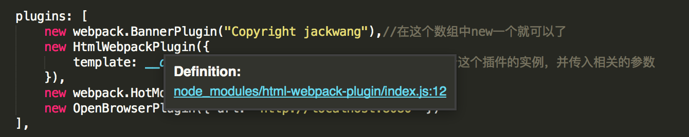
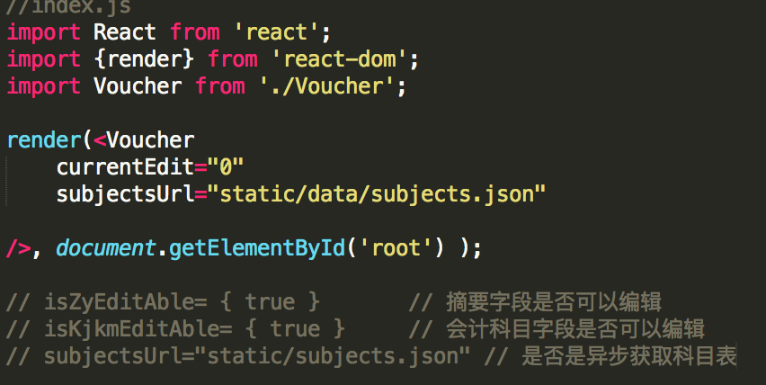
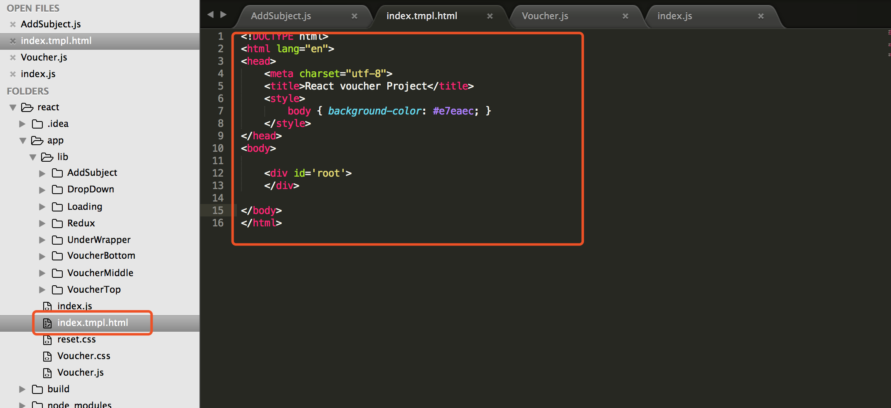

# Guide
----
项目使用 webpack 构建，集成 bable、style-loader、css-loader、postcss-loader.
开发服务器使用 webpack-server 等 webpack 插件：

具体详见 项目， 或者学习 [webpack](http://webpack.github.io/docs/)

the index.js

index.html

