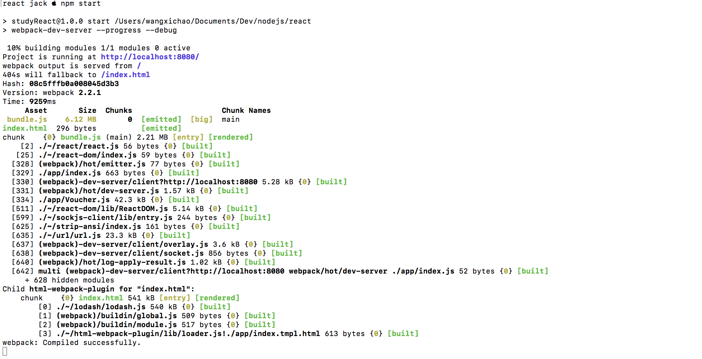
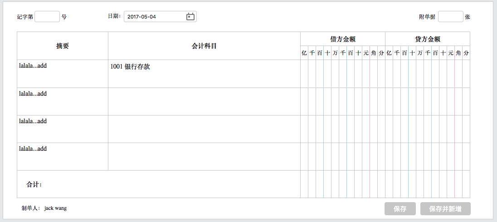

# Installation
----
此项目需要node、npm 及 git 环境， 首先你需要安装运行环境到您的设备中，如果不知道怎么安装，请自行baidu or google。以下步骤默认你已经准备好运行环境。

## 第一步：
在你的工作目录中运行：

    git clone https://github.com/ddtramp/voucher-basic.git youProjectName

## 第二步：

    cd youProjectName

## 第三步：
安装依赖，需要时间较长，请耐心等待， 也可以切换到国内镜像 [cnpm](http://npm.taobao.org/)

    npm install

## 第四步：

    npm run start or npm start

到此，你应该会看到浏览器自动打开地址 http://localhost:8080：

